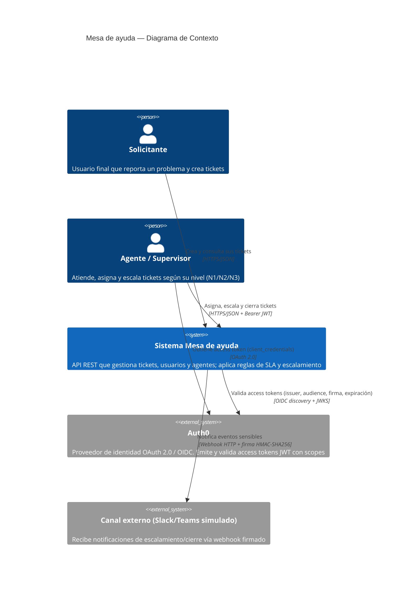

# C4 — Nivel 1: Contexto

Vista de más alto nivel: quién usa el sistema de Mesa de ayuda y con qué sistemas externos interactúa.

## Actores y sistemas

| Elemento | Descripción |
|---|---|
| Solicitante | Persona que reporta un problema y da seguimiento a su ticket. |
| Agente / Supervisor | Atiende tickets asignados; puede escalar de N1 a N2/N3 según SLA y prioridad. |
| Sistema Mesa de ayuda | El sistema que este TPI construye: API REST + persistencia + asincronía + seguridad. |
| Auth0 | Identity Provider externo: emite tokens `client_credentials` y expone JWKS para validar firmas. |
| Canal externo | Simulado con un servicio `webhook-receiver` en el `docker-compose`; representa Slack/Teams/email en un escenario real. |
