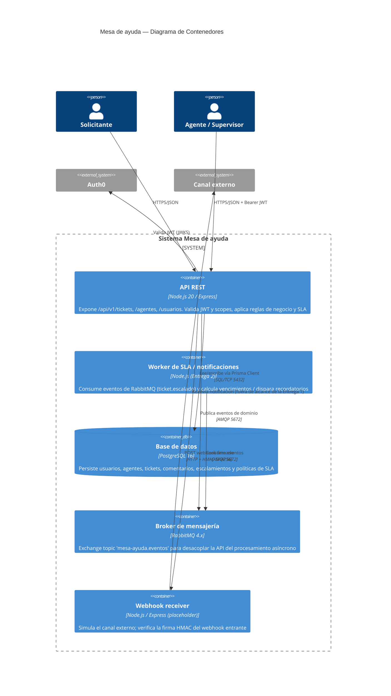

# C4 — Nivel 2: Contenedores

Zoom dentro del sistema Mesa de ayuda: los procesos/servicios que lo componen y cómo se despliegan (ver `docker-compose.yml`).

## Contenedores

| Contenedor | Tecnología | Responsabilidad |
|---|---|---|
| API REST | Node.js / Express | Expone el contrato OpenAPI, valida seguridad (Auth0/JWT + `x-api-key`), orquesta reglas de negocio. |
| Base de datos | PostgreSQL 16 + Prisma | Persistencia relacional de tickets, usuarios, agentes, comentarios, escalamientos y SLA. |
| Broker | RabbitMQ 4.x | Desacopla la emisión del evento `ticket.escalado` de su procesamiento asíncrono. |
| Worker de SLA/notificaciones | Node.js (a implementar en la Entrega 2) | Consumidor del exchange; calcula vencimientos y dispara notificaciones. |
| Webhook receiver | Node.js / Express | Placeholder del canal externo; valida la firma HMAC del webhook saliente de la API. |

Todos los contenedores corren en contenedores Docker separados y se orquestan con `docker-compose.yml` en la raíz del repositorio.
