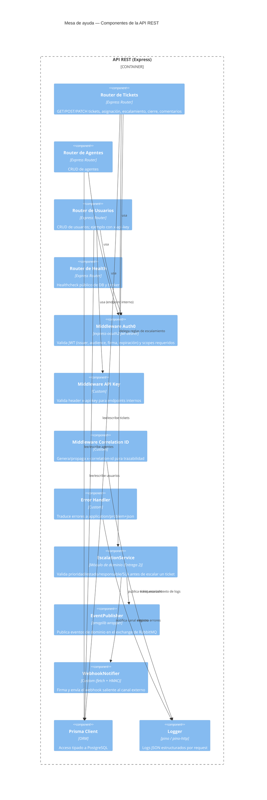

# C4 — Nivel 3: Componentes (contenedor API REST)

Zoom dentro del contenedor "API REST".

## Componentes

| Componente | Estado en Entrega 1 |
|---|---|
| Routers (tickets, agentes, usuarios, health) | Implementados; la mayoría de las operaciones responden `501` como esqueleto, salvo `GET /health` y `GET /api/v1/tickets`. |
| Middleware Auth0 (`src/middleware/auth0.js`) | Implementado y reutilizado del proyecto de la materia. |
| Middleware API Key (`src/middleware/apiKey.js`) | Implementado. |
| Correlation ID / Error Handler | Implementados. |
| EscalationService | Diseñado (ver ADR y OpenAPI); implementación funcional en la Entrega 2. |
| EventPublisher (`src/messaging/rabbit.js`) | Implementado: conecta y declara el exchange; falta la lógica de publicación real del escalamiento. |
| WebhookNotifier (`src/messaging/webhookNotifier.js`) | Implementado el envío firmado; falta invocarlo desde el flujo de escalamiento. |
