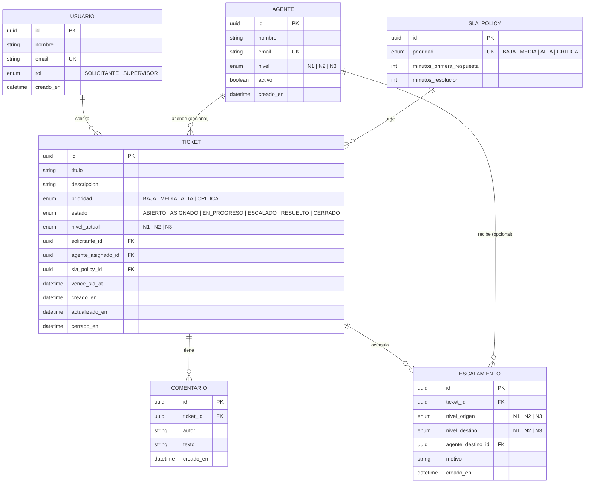

# Modelo de datos

Base de datos: **PostgreSQL 16**. Definido con Prisma (`prisma/schema.prisma`); ver [ADR 0002](adr/0002-base-datos-postgresql.md).

## Diagrama entidad-relación

## Diccionario de datos (resumen)

| Tabla | Campo clave | Notas |
|---|---|---|
| `usuarios` | `email` único | Solicitantes o supervisores. |
| `agentes` | `email` único, `nivel` | Nivel determina a qué escalamientos puede recibir. |
| `sla_policies` | `prioridad` único | Minutos de primera respuesta y resolución por prioridad; seedeada. |
| `tickets` | FKs a `usuarios`, `agentes` (nullable), `sla_policies` | `vence_sla_at` se calcula al crear/escalar según la política de SLA. |
| `comentarios` | FK a `tickets` | Historial de seguimiento del ticket. |
| `escalamientos` | FK a `tickets`, `agentes` (nullable) | Historial de cada escalamiento: de qué nivel a qué nivel y por qué. |

## Estrategia de migraciones y seed

- **Migraciones versionadas** con Prisma Migrate: cada cambio de esquema genera una carpeta en `prisma/migrations/<timestamp_o_nombre>/migration.sql`. La migración inicial es `prisma/migrations/0001_init/migration.sql`.
- **Desarrollo:** `npx prisma migrate dev` (genera y aplica migraciones, actualiza el cliente Prisma).
- **Despliegue (Docker):** el `Dockerfile` de la API ejecuta `npx prisma migrate deploy` al iniciar el contenedor, aplicando solo migraciones pendientes — seguro para reiniciar el compose sin perder datos.
- **Seed:** `prisma/seed.js`, ejecutado manualmente con `npx prisma db seed` o `npm run prisma:seed`. Usa `upsert` para ser **idempotente**: crea las políticas de SLA (una por prioridad), agentes de ejemplo (N1/N2/N3), un usuario solicitante y un ticket de ejemplo, sin duplicar si se corre más de una vez.
